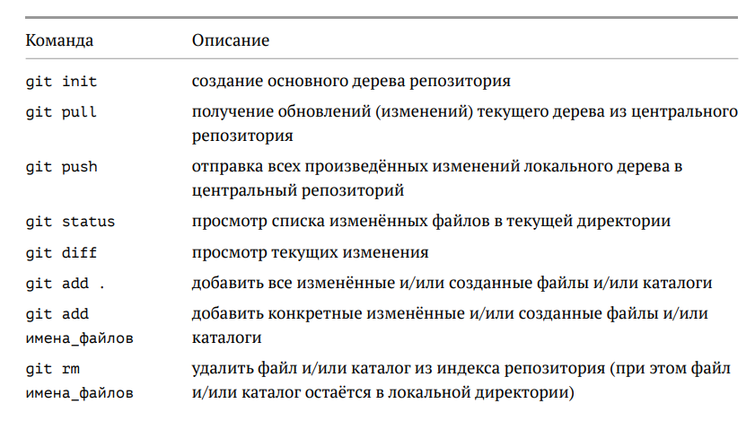

## О системе контроля версий 

Системы контроля версий (Version Control System, VCS) применяются при работе нескольких человек над одним проектом. Обычно основное дерево проекта хранится в локальном или удалённом репозитории, к которому настроен доступ для участников проекта. При внесении изменений в содержание проекта система контроля версий позволяет их фиксировать, совмещать изменения, произведённые разными участниками проекта, производить откат к любой более ранней версии проекта, если это требуется.

Системы контроля версий поддерживают возможность отслеживания и разрешения конфликтов, которые могут возникнуть при работе нескольких человек над одним файлом.
Можно объединить (слить) изменения, сделанные разными участниками (автоматически или вручную), вручную выбрать нужную версию, отменить изменения вовсе или заблокировать файлы для изменения. В зависимости от настроек блокировка не позволяет другим пользователям получить рабочую копию или препятствует изменению рабочей копии файла средствами файловой системы ОС, обеспечивая таким образом, привилегированный доступ только одному пользователю, работающему с файлом.

## Основные команды git

Система контроля версий Git представляет собой набор программ командной строки.
Доступ к ним можно получить из терминала посредством ввода команды git с различными
опциями.
Благодаря тому, что Git является распределённой системой контроля версий, резервную
копию локального хранилища можно сделать простым копированием или архивацией.



## Работа с центральным репозиторием

Работа пользователя со своей веткой начинается с проверки и получения изменений из
центрального репозитория (при этом в локальное дерево до начала этой процедуры не
должно было вноситься изменений):

    ```
    git checkout master
    git pull
    git checkout -b имя_ветки
    
    ```
По окончании работы с репозиторием следует отправить файлы на github:

   ```
    git add .
    git commit -am 'new version'
    git push
    
    ```
