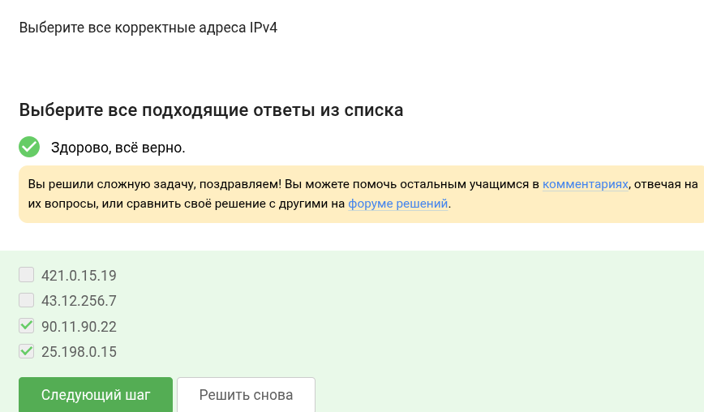
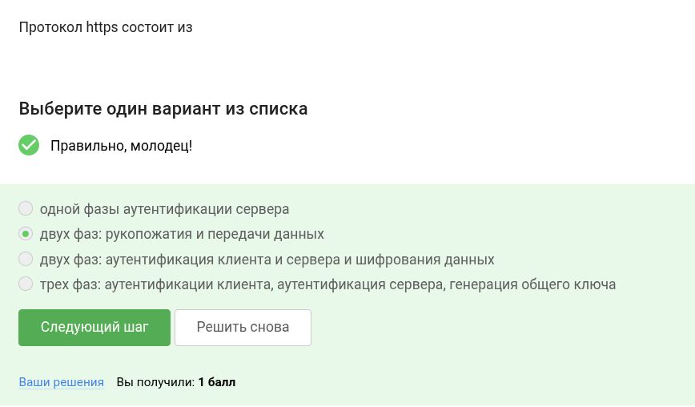
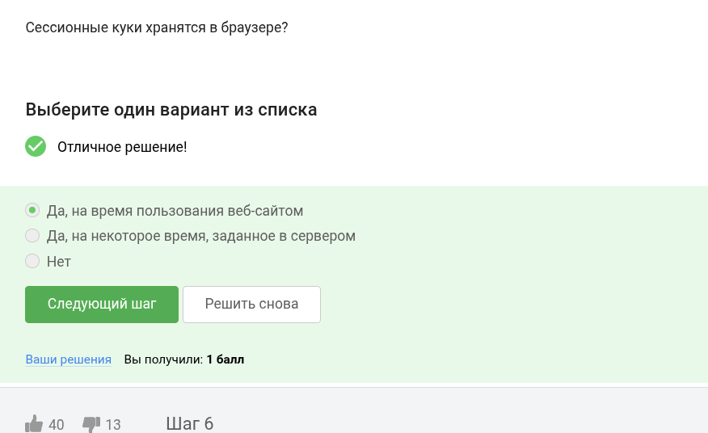
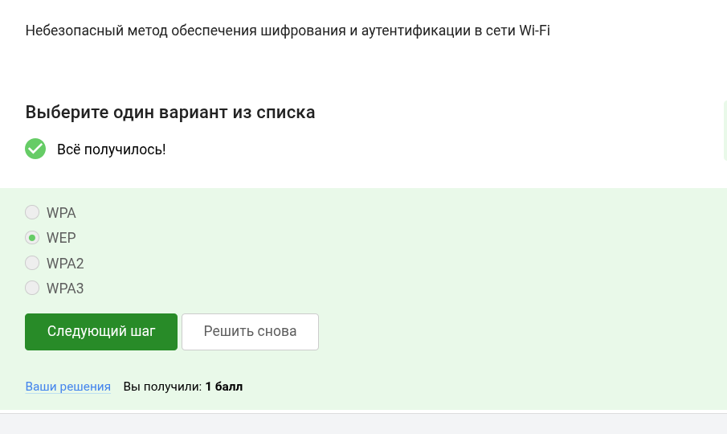

# Цель работы

Выполнить задания первой части курса по кибербезопасности.

# Выполнение лабораторной работы

UPD, TCP, IP - протоколы других уровней.

TCP вне всяких сомнений transmission - транспортный уровень.

В ip число между точками не больше 255.

DNS сервер преобразует имена в адреса.

Протоколы действительно распределены по уровням, идущим в таком порядке.

В http данные в открытом виде, в https - в закрытом.

HTTPS включает две фазы - рукопожатие и передачу данных.

Это согласовывается клиентом и сервером.

Шифрования данных нет врукопожатии.

Куки используются для персонализации контента, им не нужны пароли и ip.

Как отмечено ранее, у куки другие цели.

Сервер создает куки.

Сессионные куки очищаются после завершения сессии.

Всего три узла - входной, промежуточный, выходной.

IP скрыт от охранного и промежуточного узла.

Общий ключ создается со всеми узлами.

Это необязательно.

По определению:

Канальный, обеспечивает доступ в сеть.

Устаревший протокол, легко взломать.

Сначала аутентифицируют, потом передают данные.

Из названия понятно, что personal для личного пользования.

# Выводы

Все задания выполнены.

