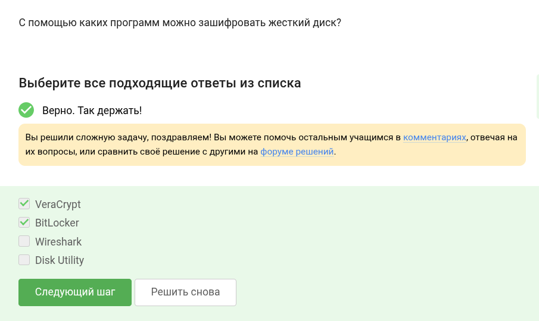
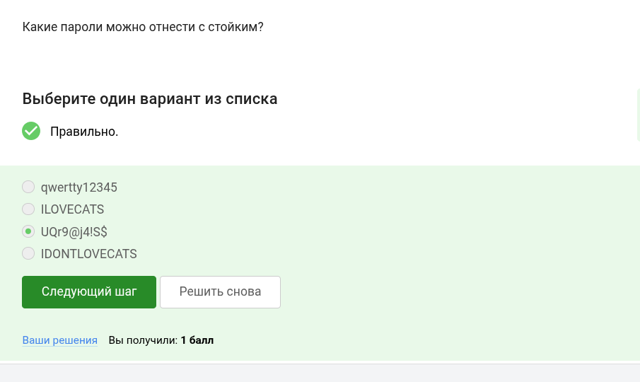
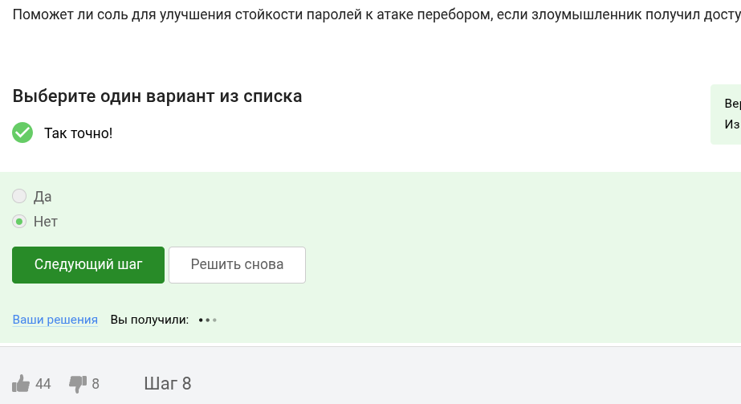
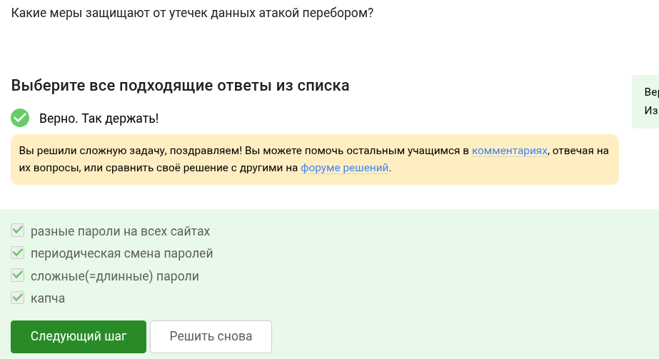
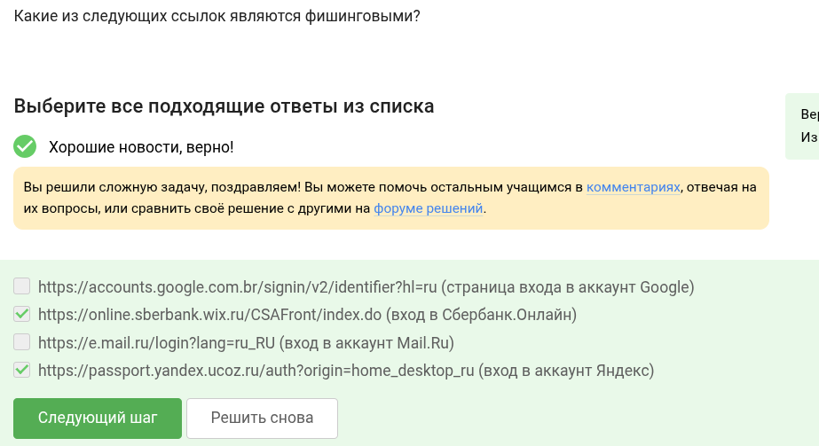
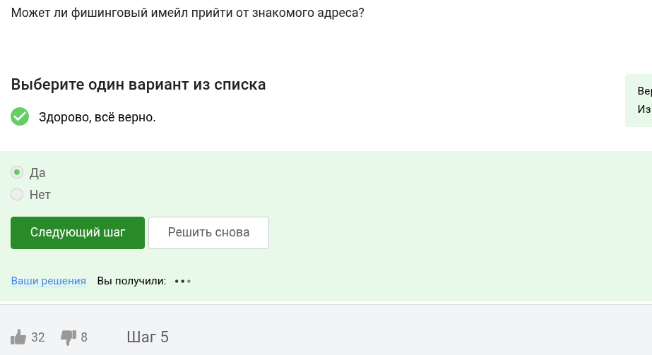
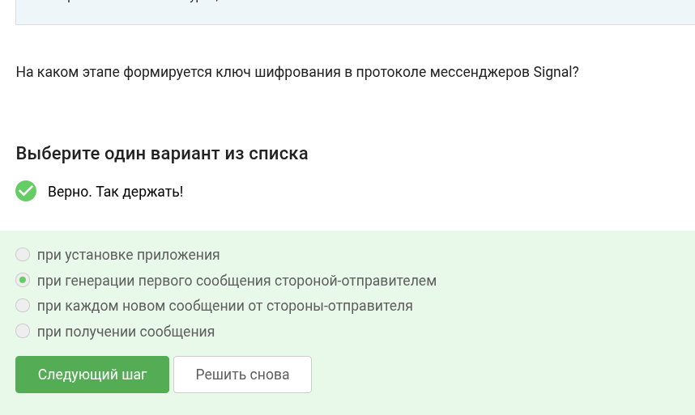

# Цель работы

Выполнить задания второй части курса по кибербезопасности.

# Выполнение лабораторной работы

Конечно, можно. Шифрование переводит данные на диске в нераспознаваемый набор символов.

Используется симметричное шифрование.

Bitlocker, vercrypt, есть и много иных.

Пароль должен состоять из разнородных символов и быть сложным для подбора.

В прочих перечисленных вариантах пароль легко украсть.

Капча смотрит подозрительные действия и спрашивает, робот вы или нет.

Для их безопасности. хэш сложно взломать.

Не поможет.

Все перечисленные варианты весьма эфеективны.

Есть отличия от оригинальных ссылок у сбера и яндекса.

Да, знакомый адрес могут взломать.

От английского spoof — обман, подделка.

На то он и троян, что маскируется и сразу не поймёшь, что это вирус.

Сразу же при первом сообщении.

Данные в зашифрованном виде передаются по узлам.

# Выводы

Все задания выполнены.

