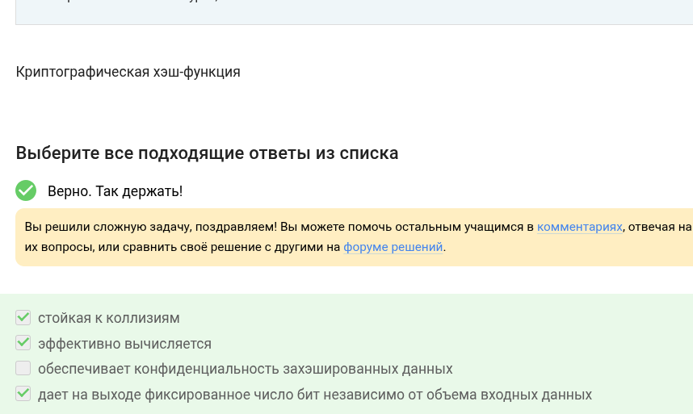
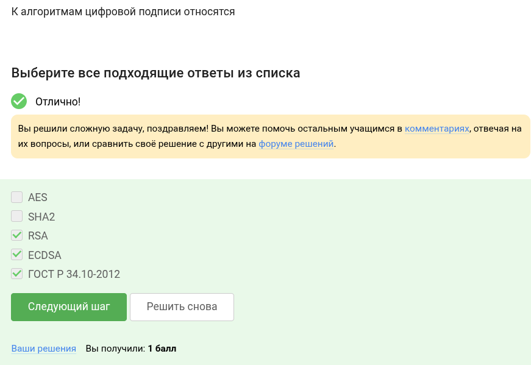
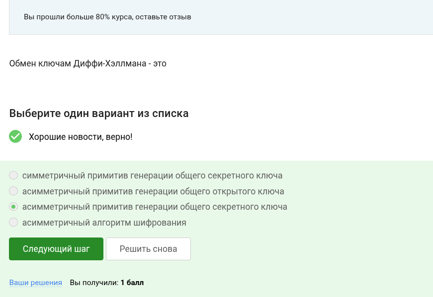
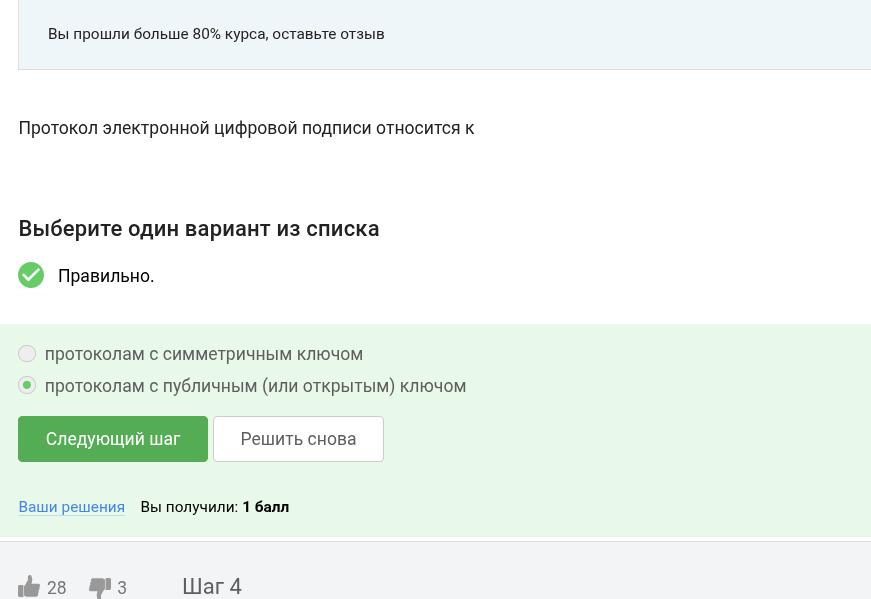
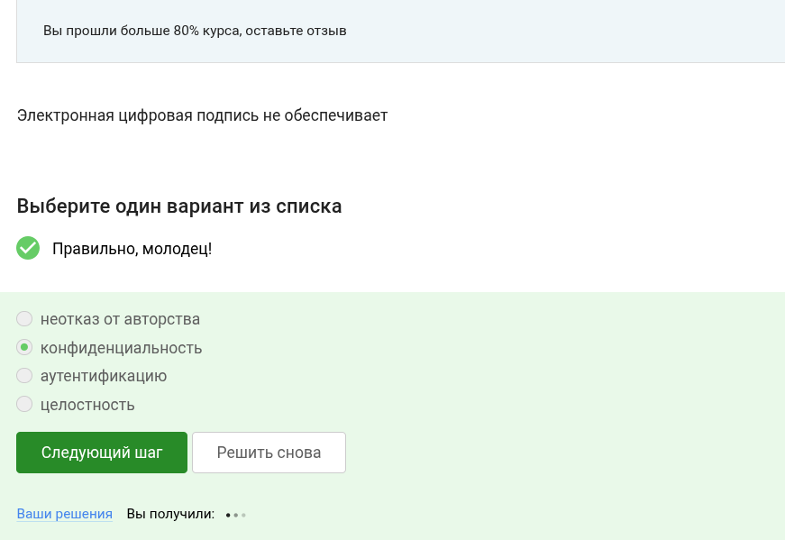
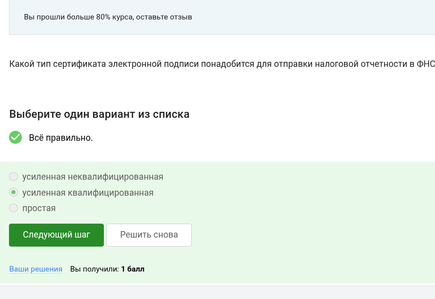
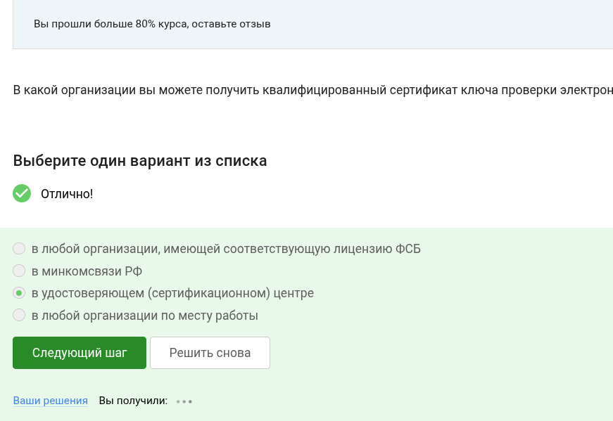
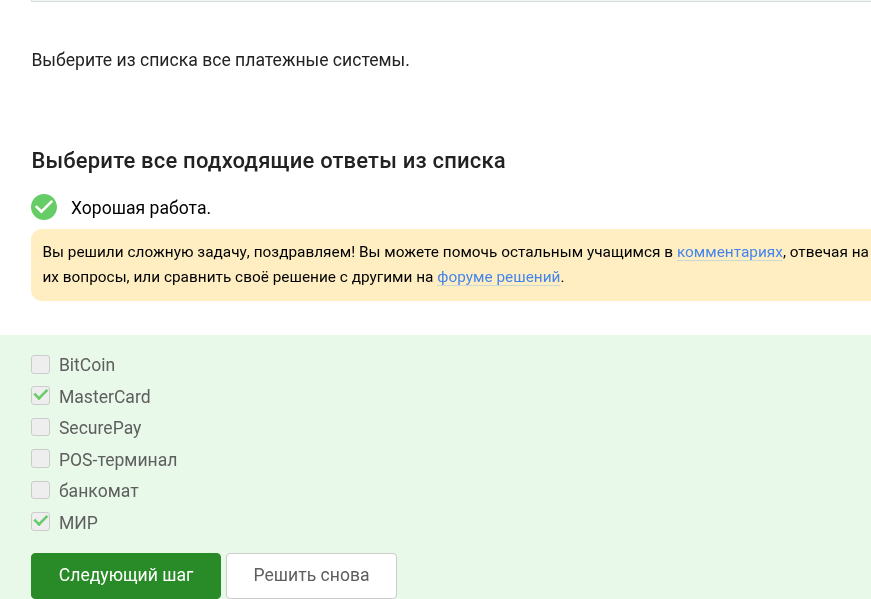
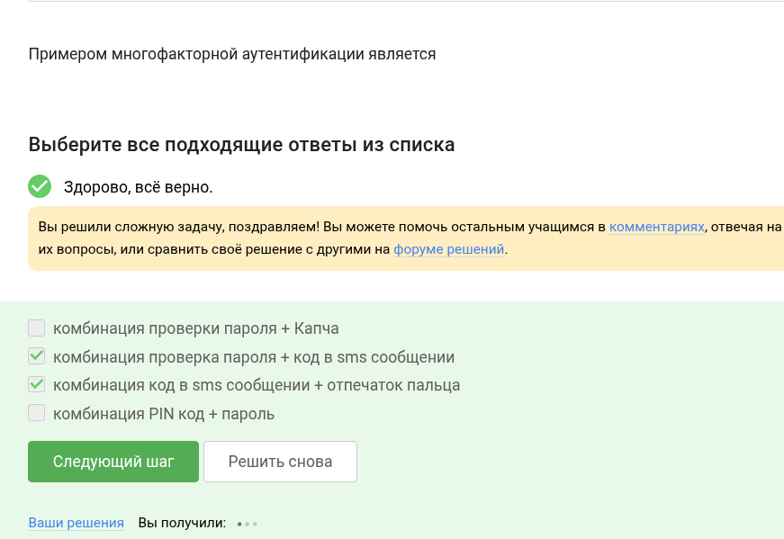
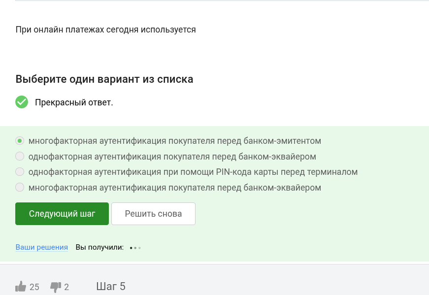

# Цель работы

Выполнить задания третьей части курса по кибербезопасности.

# Выполнение лабораторной работы

Два ключа - исходя из определения ассимитричного шифрования.

По свойствам хэш-функции.

Алгоритмы:

Так как для шифровки и дешифровки используется один и тот же ключ.

По определению этого алгоритма.

Потому что используется ассиметричное шифрование.

Подписанное сообщение проверяется открытым ключом.

Она наоборот гарантирует, что можно определить, кто подписал.

Так как в налоговую нужны юридически значимые документы.

В сертифицированном центре.

МИР и Mastercard всем известны.

Отметила верные методы.

Используется многофакторная аутентификация.

Прообраз действительно сложно найти, поэтому она надёжна.

По свойствам консенсуса.

Они хранят цифровые подписи.

Ура, я завершила курс!

# Выводы

Все задания третьей части выполнены. Курс завершён.

